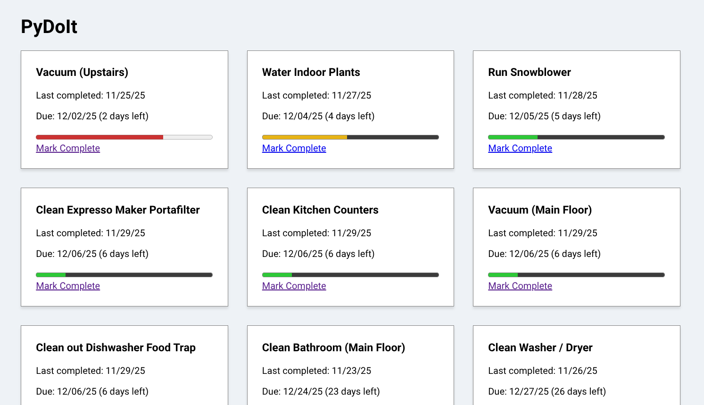

# PyDoIt

PyDoIt is a lightweight Flask application for tracking frequently completed tasks. It helps you keep an organized list of recurring chores or maintenance items, along with the last time they were completed and how often they should be repeated.

## Features
- Simple, file-based task storage 
- Tracks task name, last completed timestamp, and frequency 
- Supports recurring intervals such as **hourly**, **daily**, **weekly**, **monthly**, **quarterly**, **biannually**, and **annually**
- Minimal setup — no database required

## Screenshot


## Requirements
- Python 3.9+ 
- Flask 
- A task definition file named **todo.list**

## Task File Format

PyDoIt reads tasks from a `todo.list` file in a JSON array format.
Each task must include:

- `name` — The task description
- `last` — Last completion timestamp (`YYYY-MM-DD HH:MM:SS`)
- `frequency` — Recurrence interval

### Example `todo.list`:

```json
[
  {
    "name": "Clean out Dishwasher Food Trap",
    "last": "2025-11-29 16:43:55",
    "frequency": "weekly"
  },
  {
    "name": "Wash Car",
    "last": "2025-10-29 00:00:00",
    "frequency": "quarterly"
  }
]
